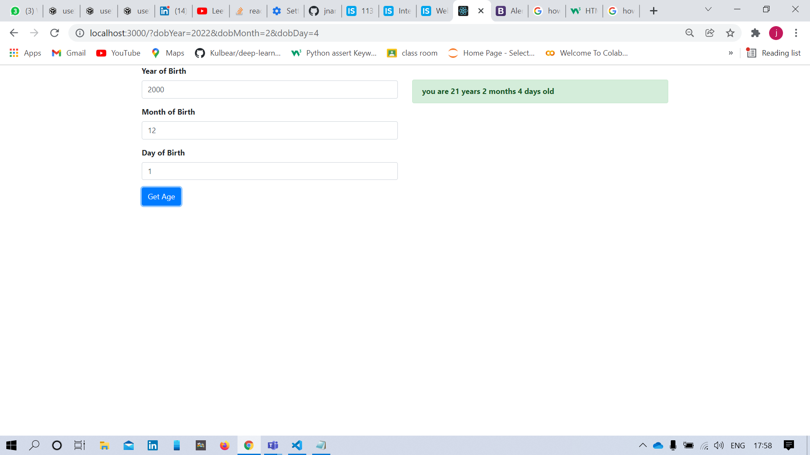

# Assessment-1 
this is a web application developed using ReactJS which calculates the Age of the user given there date of birth

the UI looks similar to the below one 

 initially you have to clone the repo into your local storage 
 
 once its done open the commad prompt or terminal and go into the main folder (using cd)
 
 then run the command "npm install" which installs all the require packages
 
 once its done enter the command "npm start" in the same directory which fire's up the react app 
 
 type in your date of birth (it alerts you if there is any error in the date of birth if you are entering (such as typing the day as 30 in the month of feb , so on and so forth))
 errors will be displayed on the top in red color
 
 on clicking the "get age" button you will find  your age in the right pane
 
